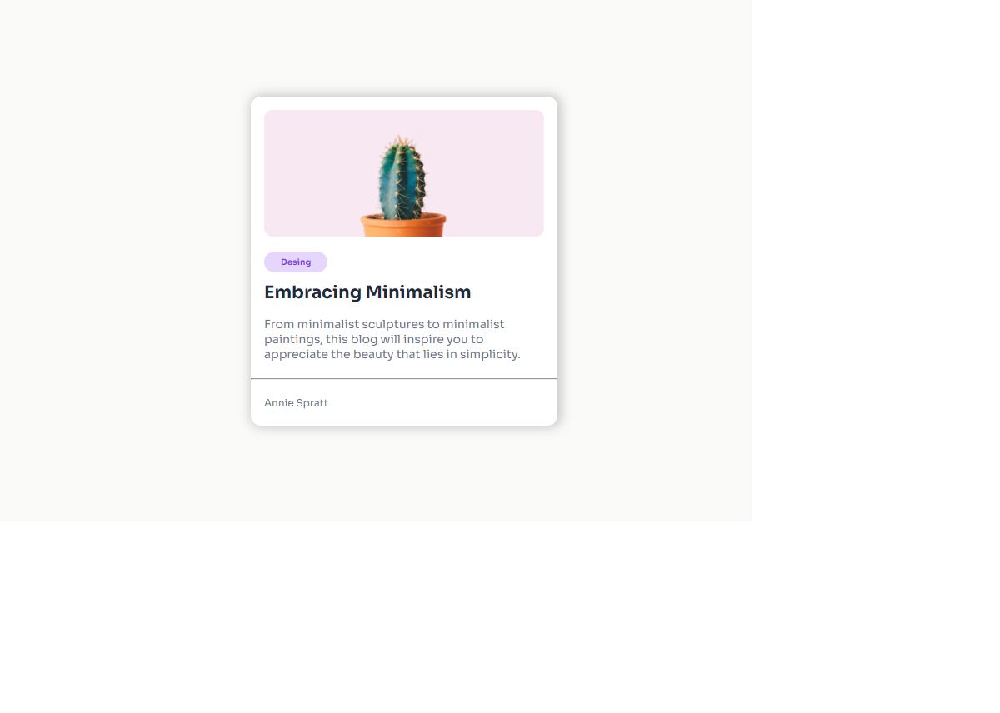

# minimal-blog-card

This challenge is a great way to start with basic HTML and CSS skills. The challenge is to create a simple blog card that includes an image, a title, a short description, and a tag.

[Minimal Blog Card](https://brayanbarroso.github.io/minimal-blog-card/)

